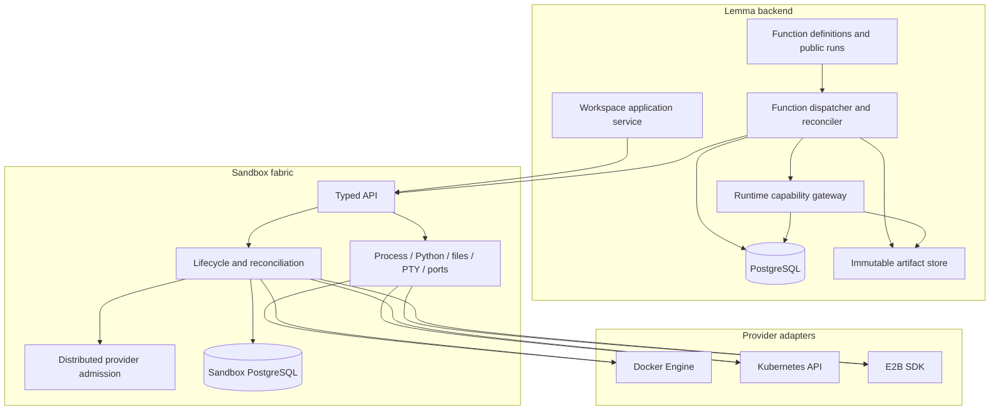
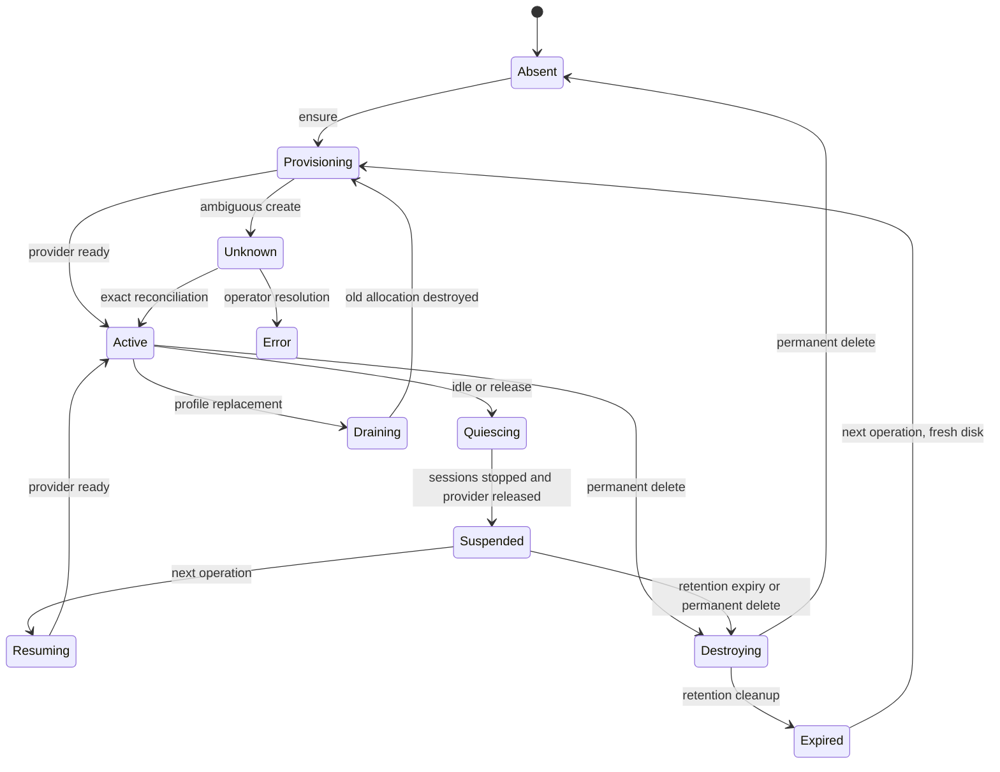
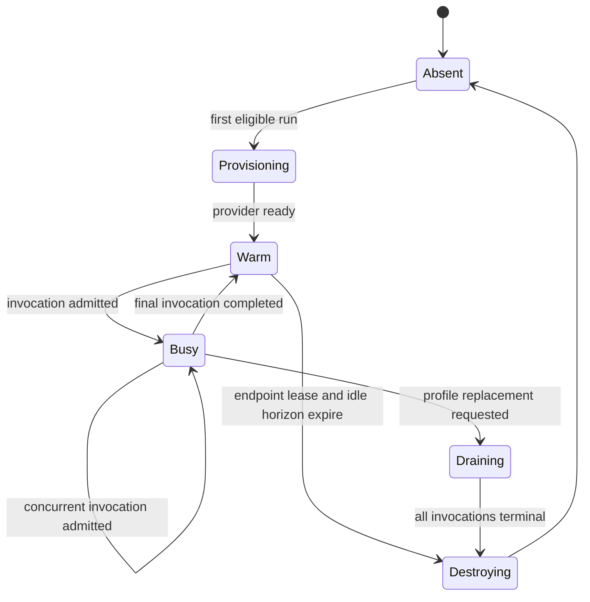

# Sandbox fabric

**Status:** Implemented and verified for Docker and E2B; Kubernetes deferred

**Date:** 2026-07-22

**Decision owners:** Lemma platform, backend, infrastructure, and security teams

**Canonical design set:**

- [Sandbox protocol](sandbox-protocol.md)
- [Lifecycle state model](lifecycle-state-model.md)
- [Provider adapters](provider-adapters.md)
- [Function execution](function-execution.md)
- [Testing strategy](testing-strategy.md)
- [Verification and rollout](verification-and-rollout.md)

## 1. Executive decision

The sandbox runtime is Lemma's provider-neutral **sandbox fabric**. It owns the parts that
must be implemented once for Docker, Kubernetes, and E2B: provider credentials,
logical-to-physical allocation, lifecycle, capacity admission, generic execution,
filesystem access, stateful Python sessions, terminal processes, application port
access, and reconciliation.

The sandbox runtime is not a function platform. The Lemma backend owns function definitions,
immutable artifacts, durable runs, API/JOB scheduling, deadlines, callbacks,
cancellation policy, results, and domain events. A function
sandbox contains one profile-owned resident runtime on a fixed private port.
The sandbox runtime starts and health-checks that opaque profile runtime and exposes it only
through an allocation-fenced direct runtime lease. The backend authenticates the
control-plane lease request with sandbox manager key, then calls the returned
Docker or E2B endpoint directly with opaque provider headers plus the delegated
function bearer. The sandbox runtime is not in the per-invocation data path and does not
interpret the invocation protocol. No durable queue or public result registry runs
inside a sandbox.

The design intentionally uses different lifecycle policies for the two workloads:

| Workload | Logical owner | Durable state | Idle action | Physical isolation |
| --- | --- | --- | --- | --- |
| Workspace | User | home-directory files | Quiesce and release | One sandbox per user |
| Function | Pod | None | Destroy after five minutes | One sandbox per pod |

The logical identity is a composite key. A UUID is never interpreted without its
workload kind:

```text
(WORKSPACE, user_id)
(FUNCTION, pod_id)
```

The function logical ID is therefore exactly the pod ID without sharing a namespace
with user workspaces. Provider-generated IDs remain private sandbox data.

## 2. Problem statement

The current implementation couples four independently difficult concerns:

1. provider lifecycle;
2. a workload-specific HTTP runtime incorrectly used as the generic control
   plane;
3. user workspace sessions and browser/application routing;
4. function scheduling and execution.

That coupling produces stacked readiness probes, manager and backend polling,
session heartbeats, public gateway routing, nested retries, provider inventory on
hot paths, and an in-sandbox function queue. A provider error can pass through
several retry loops, and an ambiguous operation can be replayed without a single
owner for the decision.

State persistence also obscures those decisions today: SQLite and PostgreSQL paths
contain large duplicated raw-query implementations, lifecycle invariants leak into
database statements, and some tests mutate private connections directly. The
replacement uses one typed SQLAlchemy repository/unit-of-work boundary so orchestration reads as
domain transitions and dialect details remain in one adapter.

E2B's native lifecycle makes the mismatch especially visible. A normal E2B pause
preserves filesystem and memory, `connect()` resumes the same sandbox, and full
memory pause supports activity-driven auto-resume. A filesystem-only pause cold
boots and cannot use auto-resume. Paused sandboxes do not expire automatically.
See [E2B sandbox persistence](https://e2b.dev/docs/sandbox/persistence) and
[auto-resume](https://e2b.dev/docs/sandbox/auto-resume).

The sandbox runtime pauses workspaces filesystem-only (`keep_memory=False`) on both edges
of the transition: its own idle release and the provider's `on_timeout`. Files
are the durability guarantee; running processes and interpreter state are
ephemeral by design and do not survive a pause. Because E2B refuses auto-resume
for filesystem-only snapshots, `auto_resume` is disabled as a consequence of
that choice rather than as an independent policy. Resume itself is not fully
under the sandbox runtime's control: `connect()` resumes a paused sandbox implicitly, so
the control plane detects and records resume rather than gating it.

E2B's `timeout` is a **continuous-runtime ceiling, not an idle timer** — nothing
happening inside the sandbox extends it, and `set_timeout` resets the clock from
the moment it is called. The sandbox runtime therefore refreshes it on every workspace
runtime operation, which turns it into an inactivity backstop that agrees with
The sandbox runtime's own idle release instead of racing an active session. E2B still
enforces a hard maximum continuous runtime per plan (24h on Pro), so a workspace
busy for longer is paused regardless.

The sandbox runtime removes the compensating machinery instead of making it more complex.
Provider adapters use the provider's strongest native data plane. The public
The sandbox runtime protocol describes portable behavior and makes nonportable behavior
explicit.

## 3. Goals

- Give Lemma one internal API for sandbox lifecycle and generic execution across
  Docker, Kubernetes, and E2B.
- Make a warm workspace command a single sandbox operation plus one provider data
  plane operation.
- Preserve user files across workspace release on every supported provider, and
  across a profile update — the only routine paths that discard a workspace disk
  are retention expiry, an explicit reset, and genuine error recovery.
- Keep stateful Python, foreground commands, background processes, stdin, PTY,
  manager-local reconnect, files, and application ports coherent across providers.
- Give API functions a bounded low-latency path and JOB functions a durable queued
  path without using a user workspace.
- Ensure one persisted allocation token causes at most one provider create request.
- Make deadlines, capacity, unknown outcomes, and retry permission explicit.
- Keep provider SDKs and credentials out of the Lemma backend.
- Run the same behavioral conformance suite against real Docker and E2B
  environments. Docker runs per-PR in CI; E2B runs on a schedule against a real
  account, because it needs live credentials and published template builds.
  Kubernetes remains specified but cannot be enabled until its later conformance
  program passes.
- Keep sandbox state transitions readable behind SQLAlchemy repositories and an
  explicit unit-of-work boundary rather than embedding raw SQL in lifecycle logic.

## 4. Non-goals

- Preserving Python variables or running processes across a portable workspace
  release boundary. Files are the portable guarantee.
- Providing persistent files, memory, or process state for functions.
- Providing exactly-once external side effects. Lemma never automatically replays
  an invocation, but arbitrary external systems remain nontransactional and a
  function may fail after producing partial side effects.
- Treating functions within the same pod as mutually hostile. The pod sandbox is
  the default strong boundary.
- Treating ordinary Docker/runc as a production hostile-code boundary.
- Hiding a reusable credential from arbitrary code executing in the same sandbox.
  Such a credential must never enter the sandbox.
- Supporting the current experimental sandbox-runtime API shape. The replacement is an
  atomic internal breaking change.
- Supporting Daytona, Podman, or additional managed providers in the first
  implementation.
- Claiming Kubernetes production support in the initial Docker/E2B delivery. Its
  adapter contract remains designed now, but production enablement waits for a
  real disposable-cluster and strong-runtime test program.
- Migrating or adopting experimental sandbox database rows, workspace files,
  sessions, processes, Docker resources, or E2B sandboxes. Cutover starts from an
  empty sandbox database and fresh provider allocations.

## 5. Responsibility boundaries



### 5.1 the sandbox runtime owns

- provider API credentials and SDK configuration;
- workload profiles and immutable template/image references;
- logical sandbox records, workspace storage identities, and physical allocations;
- provider create-rate and active-allocation admission;
- ensure, release, destroy, and exact-ID reconciliation;
- command, background process, stdin, PTY, Python, filesystem, and port operations;
- client operation deduplication and provider process references;
- provider lifecycle events and inventory reconciliation;
- normalized provider errors, deadlines, telemetry, and cost attribution.

### 5.2 Lemma workspace module owns

- user authorization and user-to-workspace mapping;
- conversation/session naming and intended working directory;
- short-lived delegated workspace credentials;
- translating agent tool calls into sandbox operations;
- user-facing output truncation and tool result schemas.

### 5.3 Lemma function modules own

- function definitions, revisions, schemas, grants, and activation;
- artifact build and retention;
- public `FunctionRun` state and API/JOB behavior;
- the durable execution queue and priority policy;
- run IDs, deadlines, callbacks, cancellation, and terminal outcomes;
- direct API dispatch and bounded JOB admission;
- domain completion events and workflow resumption.

The sandbox runtime sees a request to ensure a `FUNCTION` sandbox and open an authenticated
port to the opaque runtime declared by its profile. It does not know whether a
request through that port represents an API function, a JOB function, or another
future stateless workload.

## 6. Profiles and artifacts

A profile is immutable configuration selected by name and digest. It defines the
provider template/image, resource class, supported portable capabilities, runtime
ABI, filesystem policy, network policy, and lifecycle policy. The logical sandbox
record stores both the requested profile name and exact digest.

Initial profiles:

### 6.1 `workspace-python-v1`

- Python 3.14 and shell tooling, locked with `uv`;
- Lemma CLI/SDK;
- Node 24 LTS and browser/application tooling locked with `pnpm`;
- stateful Python support;
- reconnectable commands and PTYs;
- `/home/user/lemma` as the only project root, inside a durable home;
- public internet egress with private, link-local, metadata, and provider control
  destinations denied;
- provider-specific persistent workspace storage.

### 6.2 `function-python-v1`

- one resident `lemma-function-runtime serve` process per pod sandbox;
- revision-keyed reusable Python workers that import immutable code once and handle
  one invocation at a time;
- exact supported CPython 3.14 ABI and a locked `uv` environment;
- certificate and minimal operating-system runtime dependencies;
- no browser, Node, package installer, compiler, workspace runtime, or persistent
  volume;
- no unauthenticated public ingress; the fixed runtime port is reachable only
  through an allocation-bound sandbox grant;
- Lemma runtime gateway plus a controlled egress gateway that enforces the
  revision-declared public HTTPS destinations;
- five-minute warm idle period followed by destruction.

A profile update creates a new digest. For **functions**, the sandbox runtime drains the old
physical allocation and creates a replacement. It never mutates an active
allocation into a different profile.

**Workspaces tolerate profile drift instead.** A workspace's durable disk is
co-located with its allocation on sandbox-native providers, so replacing the
allocation to adopt a new digest would delete the user's files — a routine
deploy would wipe every workspace. While a workspace owns a disk (an `ACTIVE` or
`RELEASED` allocation) it keeps running the profile it was created with, no
generation fence is raised, and nothing is replaced. It adopts the newly shipped
profile the next time it is created from scratch: retention expiry, an explicit
user reset, or an operator-forced drain.

The consequence is deliberate: a workspace may run an N-1 template until it is
naturally recreated, so a template fix rolls out over up to the retention
window. That is the accepted trade against destroying user work on every deploy.
Because a workspace can outlive the current release, the previous release's
artifacts must stay resolvable — `WORKSPACE_RETAINED_PROFILES` carries
them into the profile registry, and dropping an entry that live workspaces still
reference makes them unreachable.

### 6.3 Package and document tooling decision

`uv` and `pnpm` are the only canonical package managers in maintained sandbox-runtime
images and templates. Lock files are release inputs; builds use locked/frozen modes
and never rewrite them. Workspace agents may use those two tools explicitly.
Function sandboxes contain only the resolved environment and do not expose an
invocation-time package installer.

LiteParse remains the workspace document parser. Its installed Node footprint is
about 31 MB. A measured MarkItDown stack was already about 79 MB after MarkItDown,
Magika, ONNX Runtime, pdfminer, lxml, Mammoth, and python-pptx, before all optional
format dependencies, and it would remove OCR, bounding boxes, page structure, and
page screenshots needed by workspace document tools. Replacing LiteParse therefore
increases this image and weakens the capability contract.

### 6.4 The filesystem contract

What a workspace sandbox guarantees about its own disk. Stated here because it is
the thing agents, tools and operators all reason about, and because getting it
wrong is silent: files land somewhere real, and simply are not there next time.

#### Two roots, answering different questions

| Path | What it is | Guarantee |
|---|---|---|
| `/home/user` | the sandbox user's home, and **the durable root** | everything under it survives for the life of the workspace |
| `/home/user/lemma` | the **project root**, inside that home | where conversations and repositories are created |

**The whole home persists, not just the project root.** That is the contract, and
it is deliberately wider than the directory Lemma itself writes to. Tools put
their state in `~` whether or not anyone planned for it — `~/.npm`, `~/.cargo`,
`~/.local/share/pnpm`, `~/.cache`, `~/.python` (the `pip` prefix), `~/.gitconfig`,
shell history — and every one of those is a cache or a setting whose whole value
is that it is still there next time. Persisting only the project root would keep
the work and throw away everything that made the work cheap, and would put the
platform back to redirecting one tool at a time by hand, which is how `PNPM_HOME`
and `UV_CACHE_DIR` came to disagree between fabrics.

So: an agent installing a package, a language toolchain writing a cache, or a user
leaving a credential helper in `~` all behave the way they would on a machine.

#### `/tmp` is the opposite, and on purpose

`/tmp` does **not** persist and must not be relied on. Session-scoped credentials
are staged there precisely so they die with the sandbox — the GitHub token, the
browser relay token, the browser profile. It is reachable from a shell, and
deliberately **not** reachable through the HTTP files route, which is a narrower
surface than a shell and is exposed to page script.

#### How each fabric keeps the promise

- **E2B** — the sandbox *is* the disk. A filesystem-only pause snapshots the whole
  rootfs, so `/home/user` persists, and so does `/opt`.
- **Docker and `lemma_local`** — a named volume is the only durable object, and it
  is mounted at `/home/user`. Anything outside it is the container layer and is
  gone when the container is replaced, with one exception: the runtime overlay
  (below) has a mount of its own. This is why the mount is the home and not the
  project root.

#### One layout: a stable image, a floor, and the overlay

Every fabric lays a workspace sandbox out the same way.

| Part | What is in it | Where it comes from | When it changes |
|---|---|---|---|
| Image | Debian or Ubuntu packages, Chrome, Node and its tools, the Python interpreter and the third-party closure (`templates/workspace-python/uv.lock`) | `Dockerfile.workspace`, or the E2B workspace template | When a dependency moves, or monthly for the package archive |
| Floor | Lemma's own code as the image baked it: the SDK and CLI in `/opt/lemma-python`, `sandbox_runtime` in `/app`, the scripts in `/usr/local/bin` | The same build, in its last and smallest layers | Only with the image, so it may be older than the release |
| Overlay | The same code, current: `site-packages/`, `bin/` and `lib/` under `/opt/lemma-runtime/current` | `scripts/build_runtime_bundle.py`, installed by the backend at session start | Every release that changes it |

The overlay wins everywhere the floor could answer. Its `site-packages` is first
on the Lemma interpreter's `sys.path` (`lemma-runtime-overlay.pth`), and its `bin`
is first on `PATH` — in the image's environment, in login shells
(`lemma-python.sh`), and in every command the backend sends
(`OVERLAY_FIRST_ON_PATH`), which is what reaches a sandbox made from an image
older than that `PATH` entry. A process that runs a Lemma script by absolute path
asks `sandbox_runtime.paths.sandbox_command`, which answers with the overlay's
copy when one is installed.

The overlay carries the **whole** workspace side of `sandbox_runtime`, and the
floor bakes exactly the same list (`RUNTIME_SOURCES`;
`test_the_images_bake_the_overlay_floor` holds the three lists together). A
partial overlay is not a smaller one. `sandbox_runtime` is a regular package, so
Python takes it from the first directory that has it and never looks in `/app`
for a submodule the overlay lacks: an overlay of three modules made every other
one vanish the moment it was installed.

What the floor is for: a sandbox the backend has not reached yet, and one whose
install failed, still works.

The workspace server is the one process that loads its code at container start,
so an install does not reach it: a fresh container's server runs the floor, a
resumed one's the previous overlay. With the image reused across releases the
floor can be older than the backend, and nothing negotiates a protocol version
between the two. So the server reports what it imported -- the overlay
version's stamp, or `floor` -- in an `X-Lemma-Runtime-Version` header on
`/health`, and after installing, the backend restarts a sandbox whose server
runs anything else, once (`workspace_runtime_restart`): released and resumed
through the provider, which keeps the home and the overlay on their mounts. Only
at the start of a session, and only with no running process or Python session;
a busy sandbox picks the overlay up at its next start instead. Never twice for
one incarnation and version: a server still stale after its restart is logged
as an error and left. A runtime that sends no header -- an image from before it
-- is left alone, as E2B, which serves no HTTP runtime, always is.

On Docker and Desktop the image is fingerprinted by its inputs and reused across
releases whose inputs did not change (see
[Desktop](../desktop.md#the-workspace-image-is-reused-across-releases)), so its
floor is routinely older than the release. That is the arrangement E2B always
had, where the template is built by hand and rarely.

#### Why the runtime overlay is not in the home

The first-party Lemma code the backend installs lives in `/opt/lemma-runtime`,
outside the durable root, and that is deliberate. `/opt` is where add-on software
belongs; it keeps what the platform installed out of the directory the user
browses; and it keeps the copy set a later disk migration works from as *the
user's files*.

It is durable on every fabric all the same. On E2B the sandbox is the disk. On
Docker it is a volume of its own, named after the workspace volume
(`<volume>-runtime`) and destroyed with it; on `lemma_local` it is a directory
beside the home on the guest's disk (`runtime/<sandbox>`), removed when the
sandbox's storage is. A replaced container starts with the overlay installed,
and the backend's probe finds its stamp instead of reinstalling. A container
created before the mount existed keeps the overlay in its own layer until it is
next replaced.

Installing needs no elevation on any fabric: the images create the directory
owned by the sandbox user and bake the `.pth` with exactly the bytes the
installer would write, so the one step that would need root is never taken.

It does place one requirement on the code. Whatever decides to reinstall must key
on the sandbox *incarnation*, not on the logical sandbox: a container replaced
without the mount keeps every file and its storage generation while losing
`/opt` entirely, and a check that missed that would report the overlay installed
while the sandbox served the image's older copy. With the mount the re-probe
costs one read.

#### What is not promised

- **Durability across workspace deletion.** The disk belongs to the workspace, not
  to the user's account; deleting the workspace deletes it.
- **Backup.** Nothing snapshots this disk. Work that must outlive the sandbox
  belongs in pod files, which is what they are for.
- **The base image.** A workspace keeps the image it was created from until it is
  recreated. First-party Lemma code is delivered into the running sandbox instead
  as a content-addressed overlay, so a code change does not require a new
  image.
- **The same image on every fabric.** The layout is the same; the images are not.
  E2B's template builds on its own Ubuntu base with Google Chrome and is amd64
  only; the Docker and Desktop image is Debian with Debian's Chromium, for amd64
  and arm64.

## 7. Lifecycle principles

### 7.1 Workspace lifecycle



- Running idle timeout: five minutes.
- Release first blocks new work, drains active operations, terminates managed
  sessions/processes, clears ephemeral credentials and browser state, then invokes
  the provider release primitive.
- home-directory files survive release.
- Session and process continuity is not portable across release.
- Suspended retention is configurable (currently seven days by default) and is
  measured from the last accepted activity; activity before that deadline resumes
  the exact physical sandbox and disk.
- Retention expiry removes compute and storage but keeps the logical workspace
  recreatable. Its next operation receives a fresh storage generation.
- Permanent delete removes every exact physical allocation and the durable storage.

### 7.2 Function lifecycle



Function allocations are never suspended. They may cache verified artifacts while
warm, but no correctness path depends on the cache. A direct endpoint lease protects
the current allocation for its bounded cache horizon; after that protection and the
idle threshold expire, the allocation is destroyed on every provider.

## 8. Reliability principles

1. **One owner per decision.** The sandbox runtime decides provider create/release/destroy
   recovery. The function dispatcher never replays an invocation; a client creates
   a new run when its own semantics permit another execution.
2. **One deadline.** Every operation carries an absolute UTC deadline. Nested
   components derive their remaining timeout and never reset the caller's budget.
3. **Create once.** Persist an allocation token before provider create. Dispatch
   exactly once for that token.
4. **Unknown provider acceptance is a real allocation state.** If provider create
   acceptance cannot be proved or disproved, retain the exact allocation token and
   reconcile it. Do not convert uncertainty into another provider create.
5. **No hot-path inventory.** Exact stored provider identity is used for normal
   operations. Inventory, webhooks, and metadata queries repair background state.
6. **No semantic retry from HTTP status alone.** Typed error provenance determines
   retry permission.
7. **No heartbeat protocol.** Active sandbox operations and provider timeouts cover
   liveness. Long operations set their timeout once from the absolute deadline.
8. **No function polling in healthy execution.** API responses and JOB callbacks
   complete durable runs. Inspection exists for reconciliation and cancellation
   only.

## 9. Security invariants

- One physical allocation belongs to one logical sandbox and workload kind for its
  entire lifetime.
- One function allocation belongs to exactly one pod.
- Provider credentials never enter a sandbox or the Lemma backend.
- Reusable human access/refresh tokens never enter function sandboxes.
- Workspace credentials are short-lived, session-scoped, and removed before
  release.
- Function invocation and the Lemma SDK use one delegated function-session bearer,
  cached for up to five minutes by `(user, pod, function, revision hash)`. Grants
  remain live backend data and are checked when the token is used rather than
  embedded in the token or revision identity. The bearer authorizes invocation,
  exact-revision artifact download, the Lemma SDK, and JOB terminal reporting.
  The backend atomically starts each run before invocation; the exact
  `function_run_id` and runtime registry provide per-call deduplication. No
  separate callback or compilation capability exists.
- Function public ingress is disabled.
- Private, link-local, metadata, cluster-control, Docker socket, and provider-control
  networks are unavailable to user/function code.
- Kubernetes function Pods mount no service-account token and no persistent volume.
- Docker is development/conformance only for untrusted multi-tenant execution.
- Kubernetes production uses an approved sandbox `RuntimeClass`, initially gVisor
  or Kata.
- Every JOB callback and terminal transition is authenticated for the exact
  function principal and `function_run_id`, then conditioned on its current
  durable state.

## 10. Source-of-truth rule

This directory is the sole target-architecture source of truth for the sandbox runtime and
sandbox-backed function execution. Module READMEs may summarize ownership and link
here, but must not restate lifecycle, retry, provider, or execution protocol rules.

The implementation is not complete merely because it matches one document in this
set. It must satisfy the protocol, all three provider mappings, function execution
invariants, and the acceptance gates together.

## 11. Glossary

| Term | Meaning |
| --- | --- |
| Logical sandbox | Stable `(workload_kind, logical_id)` requested by a caller |
| Physical allocation | One provider-created container, Pod, or E2B sandbox |
| Workspace storage | Durable home-directory content owned by one logical workspace, independent of a replaceable allocation where the provider permits |
| Allocation token | sandbox-runtime-generated unique identifier for one create attempt |
| Allocation epoch | Monotonic logical incarnation used to fence sessions/processes |
| Profile | Immutable workload image/template, capabilities, and policies |
| Operation ID | Caller-generated identifier for one generic sandbox process start |
| Provider process ID | Opaque provider-native process or runtime reference |
| Release | Stop workspace compute while preserving workspace files |
| Destroy | Permanently remove a physical allocation; for workspace delete, storage too |
| Function run ID | Durable identity and idempotency key for one requested execution |
| Unknown allocation outcome | Provider allocation creation may have succeeded but cannot yet be conclusively observed |
| Runtime gateway | Trusted backend API for exact-revision artifact access, JOB terminal callbacks, and SDK operations authenticated by the delegated function session |
| Egress gateway | Trusted proxy for the explicitly allowed function network path |
