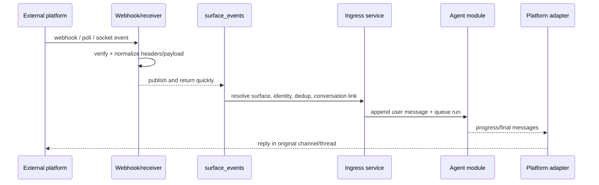

# Agent surfaces module

## Purpose

`app/modules/agent_surfaces` connects external messaging/email platforms to
pod-scoped agent conversations. It owns surface configuration, webhook/native
receiver ingress, signature verification, event normalization, external-user
identity resolution, thread-to-conversation links, attachment ingestion,
platform tools, progress rendering, and outbound delivery.

Supported adapters are Slack, Microsoft Teams, Telegram, WhatsApp, and Resend
for email. Gmail and Outlook are **connectors**, not surfaces: an agent reaches a
Gmail account through the connector, but a pod is reached *on* email at its own
Resend address.

## Runtime contributions

| Contribution | Behavior |
| --- | --- |
| API routers | Pod surface CRUD/setup/catalog/send, current-user defaults, public webhooks/verification |
| Redis consumers | Surface webhooks, schedule fires, and pod deletion |
| streaq task | Execute one prepared surface message outside the webhook request |
| Worker lifespan | Optional Telegram polling and Slack Socket Mode receivers |
| API/worker cleanup | Close Redis event-dedup clients |

## Main data model

| Table | Meaning |
| --- | --- |
| `agent_surfaces` | Pod/platform/name, the one agent it answers as, account binding, allowed channels, identity and send policy |
| `agent_surface_external_users` | Stable external identity to Lemma user/contact resolution |
| `agent_surface_conversation_links` | External channel/thread to agent conversation mapping |
| `surface_verified_identities` | One row per hashed platform/tenant/installation/actor binding: that this person proved who they are, and the pod and installation their private chat reaches. A check constraint keeps a revoked identity from holding a destination, so a live route beside a revoked proof is unrepresentable rather than merely unlikely |
| `surface_pending_onboarding` | Onboarding in flight for one binding — step, email challenge, offered pods, and the original inbound event held until there is a conversation to commit it to |
| `surface_onboarding_input_tokens` | Hashed handles for a native input form — a Slack modal, a Teams card, a WhatsApp prompt — each minted against one pending row, step and challenge. A submission is accepted only while all three still match, so a form left open across a step stops working rather than answering the wrong question; the cleanup sweep deletes handles at expiry |
| `surface_whatsapp_numbers` | The deployment's WhatsApp numbers, one row each and each independent: its own WABA, access token, verify token and Flow ids, every one falling back to settings when absent so a single-number deployment declares nothing. `role` separates the one `SHARED` line everybody rides from the `ALLOCATABLE` pool; `status` separates "stop handing this out" from "we no longer own it". Who holds a number is not stored here — it is `agent_surfaces.surface_identity_id`, so there is no second copy to disagree |
| `notifications` | Something the pod needs a person to see: recipient, actor, origin, body, optional background instruction, and open/expiry state. It lives in this module because delivery is surface work; the agent and workflow modules reach it through ports in `app/composition` |

Conversation metadata records surface, platform, external user/channel/thread,
and message identifiers so delivery and debugging do not depend only on the
link table.

Onboarding storage is deliberately private rather than pod-scoped: a person
being recognised and a person having somewhere to talk are different states,
and the gap between them is one a real user sits in while they pick or wait for
a workspace.

A WhatsApp number is shared across organisations and exclusive within one:
`uq_agent_org_whatsapp_number` is unique over (organisation, number), so several
organisations may hold one number and exactly one surface in each of them does.
That makes an arriving number ambiguous by construction, which is why routing
resolves the *sender* first and uses the number only as an additional predicate
on candidates already narrowed to the sender's pods. `agent_surfaces` carries
`organization_id` for that rule rather than joining `pods` for it, and a
composite foreign key `(pod_id, organization_id)` makes the carried copy
impossible to leave stale.

## API groups

| Routes | What they do |
| --- | --- |
| `/pods/{pod_id}/surfaces` | CRUD surface installations and send a message |
| `/.../setup`, `/.../channels`, `/surface-setup`, `/available-surfaces` | Setup state/guides and platform/account catalog |
| `/surfaces/me` | List reachable user surfaces and choose a default |
| `/surfaces/webhooks/{platform}`, `/surfaces/{surface_id}/webhook` | Platform-wide or direct webhook ingest/verification |
| `/surfaces/teams/admin-consent/callback` | Teams tenant consent completion |

## Ingress and egress

Adapters share a contract for parse, enrich, sender profile, `send_message`,
`deliver`, interaction parsing, processing indicator, and platform tool
construction. Attachments may be downloaded, stored through datastore,
transcribed, or referenced depending on size/type. Email surfaces use
subject/thread/address semantics rather than chat streaming.

**Outbound content goes through one seam.** An agent produces a
`SurfaceEnvelope` — text, resources, files, voice, choices, a decision — and
`deliver()` renders whatever the platform can and degrades the rest, returning a
`DeliveryReceipt` saying how each part landed (`NATIVE`, `DEGRADED`,
`UNDELIVERED`). The per-content `_render_*` hooks are a platform's private half
of that call and are reachable only from `deliver`; there is no public verb per
kind of content, which is what keeps "every platform gets the full product" a
behaviour rather than a promise each adapter keeps separately.

**How many messages a platform gets** is `DeliveryCardinality`. Chat platforms
are `MANY` and each part degrades on its own. Email is `ONE`: the whole envelope
folds into a single reply, so a file or a voice note is an attachment on it
rather than a second send.

`enrich_inbound_event` is optional for most adapters and **mandatory for
Resend**: its `email.received` webhook carries metadata only — no body, no
headers — so the adapter fetches the message from the Received Emails API and
drops the event if that fails. Running on what the webhook alone provides means
starting an agent on an empty prompt.

Each agent is provisioned its own inbound address, `{agent}.{pod}@{domain}` on
`RESEND_INBOUND_DOMAIN`, at creation. Inbound routing matches the surface by
that address, so it is unique-indexed: two pods colliding would silently deliver
one pod's mail into the other's.

### Interactive tools and indicators

`ask_user` and `request_approval` pause the agent run (`WAITING`); the run
observer renders them on the surface and a submission resumes the run.

- **Native first, text fallback, never swallowed.** `ask_user` renders as native
  choices and `request_approval` as native **Approve / Deny** (optionally
  **Approve for session** when the paused call carries `permission_ids`) buttons
  on Slack (Block Kit), Teams (Adaptive Card `Action.Submit`), Telegram (inline
  keyboard), and WhatsApp (reply buttons). Any platform without native support —
  or a native render that fails — falls back to a formatted text prompt.
- **Decision routing.** A tapped approval button carries its decision back
  through `parse_inbound_interaction` → `ParsedSurfaceInteraction.approval_decision`
  (a canonical `AgentRunApprovalDecision` value) → `handle_interaction`, which
  resolves the paused run APPROVE_ONCE / DENY / APPROVE_FOR_SESSION. `ask_user`
  answers ride back keyed by question header. Both reuse replay-dedup and
  submitter-owns-conversation authorization.
- **Indicators.** WhatsApp marks the inbound message read (blue ticks) and shows
  a typing bubble via one Cloud API `status:read` + `typing_indicator` call.
  Telegram/Teams use a refreshed typing indicator; Slack streams a status line;
  WhatsApp/email have no per-step streaming.
- **Email is interactive, asynchronously.** `ask_user`/`request_approval` on an
  email surface put the question in the one reply and end the run. The person
  answers by replying, and `maybe_resume_pending_interaction` resolves the pause
  through the same path a tapped Slack button takes. A typed reply that is not a
  decision is *not* consumed: it falls through to the ordinary message path,
  which supersedes the pending call with an explicit denial and delivers the
  person's actual words to the agent.

### Routing, defaults, and history

- **One precedence decides where a private message goes.** Routing answers only
  *which* pod, surface, agent and conversation a message belongs to, highest
  first: pod membership → a valid saved default (`/surfaces/me`) → a verified
  personal route → continuity → oldest-tiebreak. The saved default is the
  person's explicit choice, so it is **authoritative over a personal route and
  over continuity**; a stale default (pointing at a pod the user left) is cleared
  and ignored, and the personal route then answers again. `SurfaceRouter`
  documents the order; `select_surface` applies it to ordinary delivery and
  `deliverable_default` is how the personal route (Slack and Teams, which answer
  a private message from the person's own pod through a company installation)
  steps aside for a default that ordinary selection would honour on that
  delivery. WhatsApp and Telegram have no personal route -- their pod is a
  per-pod surface on the shared bot -- so selection alone decides there.
- **A private chat is one conversation wherever it is delivered.** The link key
  names a delivery address (surface, channel, thread id), and on WhatsApp that
  embeds the number the message arrived on. For a private chat that address is a
  delivery detail: when the exact key misses, selection and the binder look for
  the same person's latest private-chat link on a candidate surface (the pod's
  own surfaces, for the binder) and move that link to the new address, so a
  reassigned pool number keeps the conversation. Only a link whose conversation
  is the sender's own, in the route's pod and with the route's agent, is taken;
  the reset window still applies. Channel and email threads are never adopted.
- **A sender is a user only on proof.** A chat sender resolves to a Lemma user by
  the profile email or Telegram handle, or by a mobile number already
  *verified* on the profile. A number a profile merely lists does not match by
  default: it would hand the number's real owner's messages -- and the agent's
  replies, sent from the shared number -- to whoever typed it. That sender goes
  through signup instead. A deployment can accept that risk with
  `SURFACE_ALLOW_UNVERIFIED_PHONE_MATCH=true`: a number claimed by exactly one
  profile then routes to it, each such match is logged
  (`unverified_phone_match_used`). A verified owner always wins; a number claimed by several *unverified* profiles never matches.
- **DM reset window.** A DM starts a fresh Lemma conversation after
  `SURFACE_DM_CONVERSATION_RESET_AFTER_HOURS` (default 24) of inactivity, measured
  from the last *inbound* message. It is deployment-wide; the old per-surface
  `dm_conversation_reset_after_hours` field is accepted and ignored.
  This is the only place a surface decides which conversation a message joins.
- **History is not the surface's.** A surface never trims or reshapes what the
  model sees. Once a message is bound to a conversation, the agent module alone
  decides how much history the run carries (run cap, whole recent runs,
  collapsed older runs, token compaction).

## Authorization and security

Management routes use pod permissions and ensure connector account ownership.
Webhook security handles Slack signatures, Teams/Telegram/WhatsApp verification,
email provider metadata, timestamp windows, and challenge responses. Identity
policy controls whether unknown external senders are rejected, linked, or
represented as contacts. Redis dedup guards repeat provider deliveries.

A contact shared during Telegram signup is matched by `onboarding_contact`: a
verified profile number first, then -- only with
`SURFACE_ALLOW_UNVERIFIED_PHONE_MATCH` -- exactly one unverified claim, the same
rule identity resolution applies to later messages. Whether an account's email
must be verified to chat follows `AUTH_EMAIL_VERIFICATION_REQUIRED`
(`identity.infrastructure.chat_account_policy`).

A pooled WhatsApp number answers with its own pool row's credentials for
everything done to a message that arrived on it -- the read receipt, the typing
indicator, the media download, the fallback and the reply -- through
`SurfaceCredentialResolver`'s `arrived_on`. A delivery the per-number webhook
refuses logs `whatsapp_number_signature_rejected.denied` (the number, why, and
which secret was tried, never the secret) or `whatsapp_number_mismatch.denied`,
and counts on `lemma.surface.webhook.rejected` by `platform` and `reason`.

## Tests and operations

The large unit/e2e matrix uses real payload fixtures and mock provider servers
for platform parsing, signatures, conversation reuse, identity, attachments,
approvals/forms, progress, and delivery. Measure this module's coverage with
`uv run pytest -m "not e2e" app/modules/agent_surfaces --cov=app/modules/agent_surfaces`;
CI enforces the committed floor. The in-module README is a pointer back here and
deliberately carries no route examples of its own.
