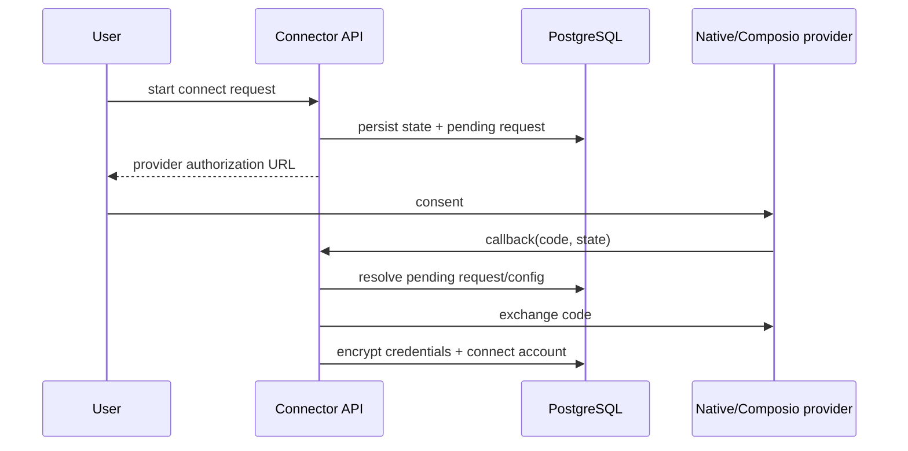

# Connectors module

## Purpose

`app/modules/connectors` manages third-party application capabilities. It owns
the connector/operation/trigger catalog, organization auth configurations,
user-owned connected accounts, OAuth/credential flows, operation discovery,
and operation execution routing between native Lemma integrations and Composio.

## Runtime contributions

The module contributes eight API routers and no event consumer or background
task. Long external operation calls use a resolve -> external call -> persist
saga so a pooled database connection is not held during provider I/O.

## Main data model

| Table | Meaning |
| --- | --- |
| `connectors` | Provider-independent application catalog entry |
| `connector_operations` | Searchable operation metadata and JSON input/output schemas |
| `connector_triggers` | Available external trigger metadata |
| `auth_config_operations` | Operations discovered for one organization's install. MCP tools and OpenAPI-URL endpoints describe a customer's own systems, so they are kept out of the global catalog entirely rather than held there behind a nullable tenant column |
| `auth_configs` | Organization installation/configuration and encrypted OAuth client secrets |
| `accounts` | User-owned encrypted provider credentials and connection status |
| `connect_requests` | Short-lived OAuth state and authorization flow metadata |

## API groups

| Routes | What they do |
| --- | --- |
| `/connectors` | Public catalog, connector detail, and generated skill text |
| `/organizations/{org}/connectors/status` | Installed/connected capability summary |
| `/.../auth-configs` | Create/list/get/delete organization auth configurations |
| `/.../accounts` | Create/list/get/delete user accounts and resolve account credentials |
| `/.../connect-requests` + callback | Start OAuth and exchange callback state/code |
| `/.../{auth_config}/operations` | Search/details and execute an operation |
| `/.../{auth_config}/triggers` | Discover provider triggers |

A trigger's `config_schema` is returned by the single-trigger endpoint, not by
the list — the list is deliberately lean. It declares the parameters a schedule
may narrow the trigger by, and those go at the top level of the schedule's
config, which is what the routing key is matched against. Keys a person cannot
sensibly supply are bound when the schedule is created: GitHub's
`installation_id` comes from the connected account's `external_ref`, which is
where the App install redirect recorded it.

## OAuth and execution flows

For execution, a short UoW resolves the auth config, operation, account, and
decrypted credential values into a session-free DTO. The provider call happens
outside a UoW; a final short UoW marks accounts for reauthentication when an
unauthorized response is classified.

A credential refresh fails one of two ways, and they answer differently. When
the provider says the grant itself is gone (`invalid_grant`, `invalid_client`,
`unauthorized_client`, a Composio connection in a terminal state), or an expired
token has nothing to refresh with, the account is marked `REAUTH_REQUIRED` and
the caller gets a 409 `CONNECTOR_REAUTH_REQUIRED` naming the account to
reconnect. A provider that is unreachable or answers 5xx is a 502
`OAUTH_FLOW_ERROR`, because retrying may help and reconnecting will not.

A Composio toolkit's `system_default_available` can turn false on a later
catalog import. Connecting through a Lemma-default install of such a toolkit is
refused with the same 400 as creating one, and the importer disables those
installs and flags their accounts `REAUTH_REQUIRED`, so the organization is
asked to bring its own OAuth app.

## Authorization and secrets

- Auth configurations are organization-scoped; accounts remain owned by one
  user even when the auth configuration is shared.
- Credentials are encrypted by the shared versioned secret cipher.
- Operation execution resolves the caller's permitted account and scopes before
  calling a provider.
- Provider-specific capabilities live behind auth-provider and operation-gateway
  adapters.

## Tests and operations

Tests cover native and Composio routing, OAuth state, account identity,
credential encryption/refresh, catalog import, and operation timeouts. Dynamic
connector schemas are parsed by a restricted AST reader, never `exec()`; see
`infrastructure/schema_compiler.py` and its hostile-input tests.
